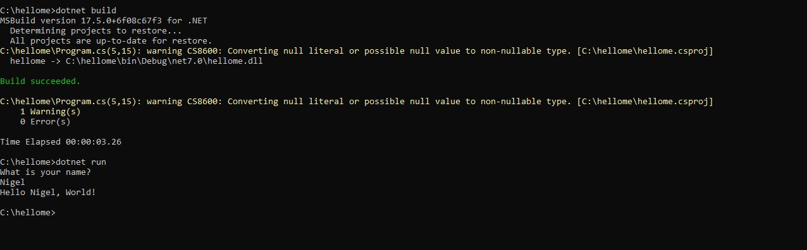

# C# Build Tools -Development Workflow & Environment Setup

To be able to write and run code, we must install the right software on our machine. By following this guide you will have a computer that is ready for coding in C#. Please follow the instructions that are specific to your operating system.

## Objectives

- Experience C# development in Visual Studio AND Visual Studio Code
- Create / Open / Build / Execute / Debug New/Existing Projects
- Understand single, multi & xml comments
- Understand solution, project layout
- Nuget package manager
- Install Visual Studio 

## Create / Open / Build / Execute / Debug New/Existing Projects

***If you already have VSCode installed on your machine***

Lets start by creating a C# application:

If you are on Windows Open the Command Prompt and follow the steps in the image below:

In NOTEPAD change the code so it reads:

// See https://aka.ms/new-console-template for more information

Console.WriteLine("What is your name?");

string name = Console.ReadLine();

Console.WriteLine($"Hello {name}, World!");

Now see if the code builds (dotnet build), then run it (dotnet run).

Note the Build Succeeded.  If it doesn't build you can go back into notepad to check the code before running.  Should be able to enter your name and see
the response from the application.

thats it! Congratulations :-)

## VS Code
In VS Code the process is the same

### Other Project Types

The command **dotnet new list** will show all templates that you can scaffold with the dotnet command.  If you have wpf in your list, try **dotnet new wpf** for a windows application!  
Install more templates from the link (windows):
https://learn.microsoft.com/en-us/dotnet/core/install/templates?pivots=os-windows

## Visual Studio
The ultimate IDE for C# develoopment has to be Visual Studio.  

## Install Visual Studio

This can currently be installed on MAC/PC

[Windows Setup Instructions](windows-setup-instructions.md)

[macOS Setup Instructions](macOS-setup-instructions.md)

