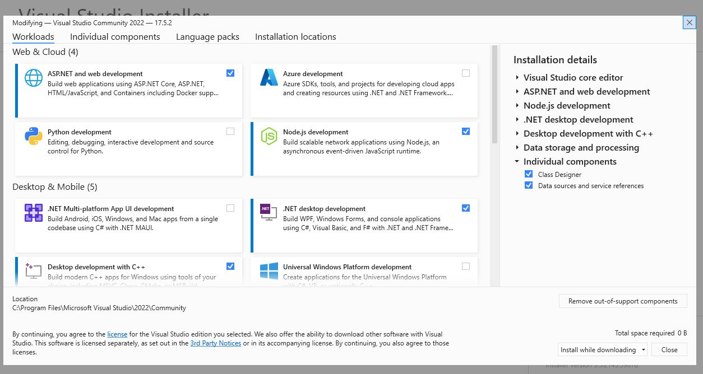

# Developer Environment Setup - Windows

Please install Visual Studio Community Edition for Windows.

Download available on [Microsoft's website](https://visualstudio.microsoft.com/downloads/).

Please accept the default options, making sure you include the `ASP.NET and web development` module.

